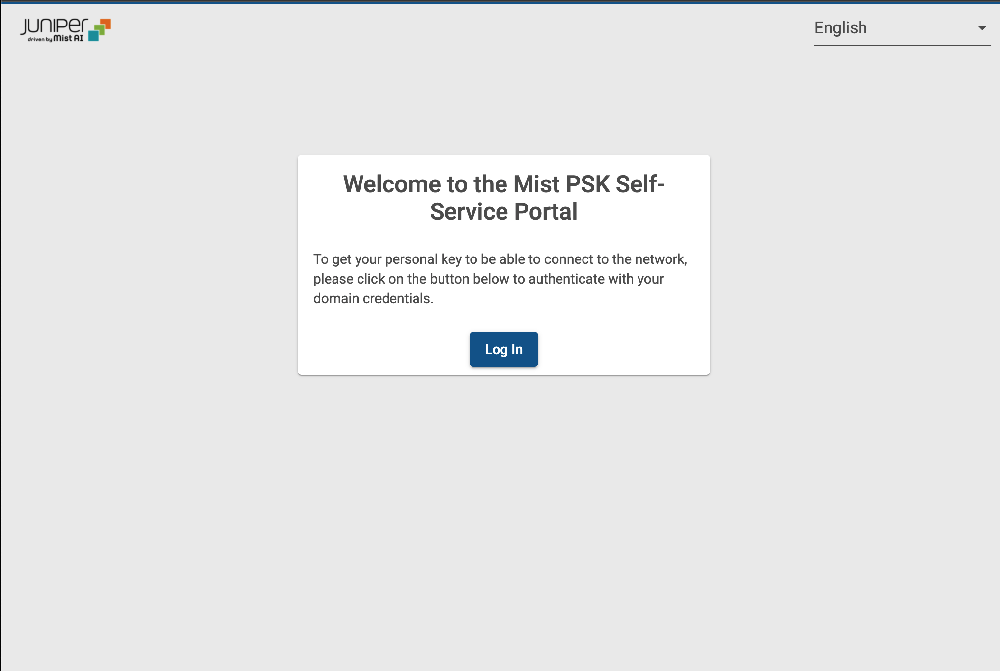
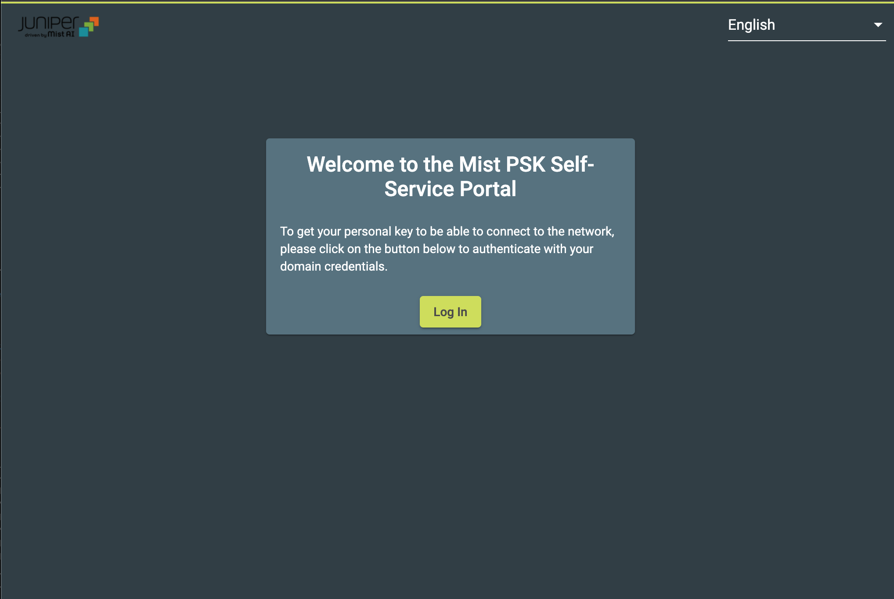
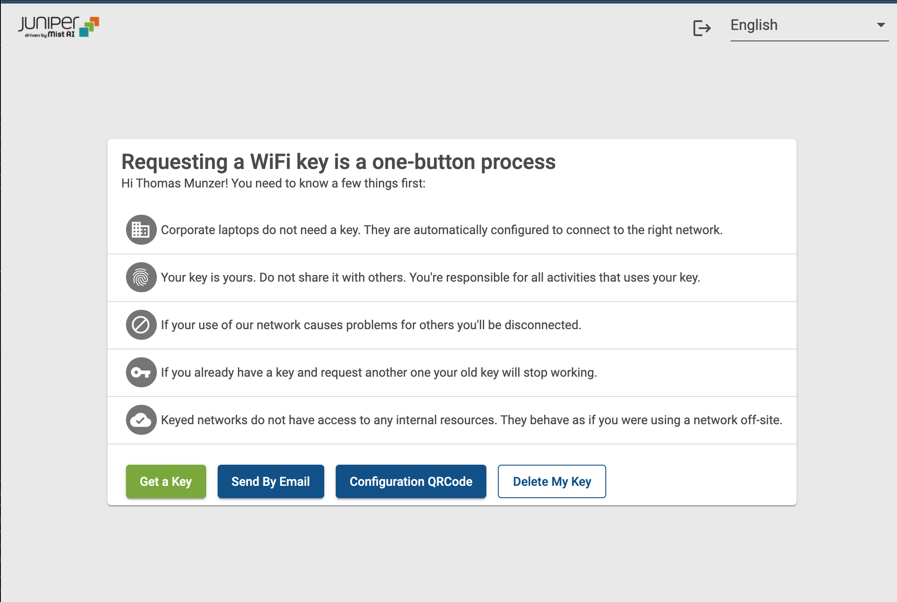
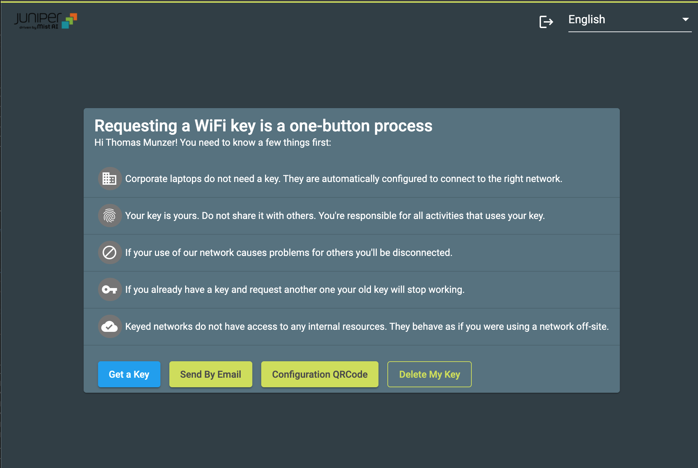

# Mist PSK Self Service
This application provides a single page app to get a Mist PSK from the Mist Cloud. This App can use AzureAD, ADFS/SAML, Okta or Google authentication.

This program is distributed in the hope that it will be useful, but WITHOUT ANY WARRANTY; without even the implied warranty of MERCHANTABILITY or FITNESS FOR A PARTICULAR PURPOSE. See the GNU General Public License for more details.

# Mist PSK Self Service v1
* Admin interface to configure:
  * the Mist integration 
  * the Authentication method
  * the logo and colors 
  * the translations
* AzureAD, ADFS/SAML, Google and Okta integration
* User self-service portal with Email and QRcode features

## Install
This Reference Application can be used as a standalone Application, or it can be deployed as a Docker Image (recommanded).

### Deployt the Docker version (recommanded)
This application is available as a [Docker Image](https://hub.docker.com/repository/docker/tmunzer/mpss). The Dockerfile is also available if you want top build it on your own.

#### Run the Docker version
`   docker create -v  <path_to_config.js>/config.js:/app/config.js:ro --link <mongoDB_container_name>:mongo --name="<container_name>" -p 3000:80 tmunzer/mpss`

#### Configure the Docker version
Configuration can be done through the config file. An example of the `config.js` file can be found in `src/config_example.js`. Then, you just need to link the `config.js` file to `/app/config.js` in you container.

You can also use environment variables to configure the app:

Variable Name | Type | Default Value | Comment 
------------- | ---- | ------------- | ------- 
NODE_HOSTNAME | string | null | Server FQDN. Used to forge the url. |
NODE_PORT | int | 3000 | TCP Port used for HTTP |
NODE_HTTPS | boolean | false | enable HTTPS in Node. require `NODE_HTTPS_CERT` and `NODE_HTTPS_KEY` |
NODE_PORT_HTTPS | int | 3443 | TCP Port used for HTTPS.. Only used if `NODE_HTTPS == true` |
NODE_HTTPS_CERT | string | null | certificate file name for HTTPS. The certificate file must be placed inside the `src/certs/` folder |
NODE_HTTPS_KEY | string | null | certificate key file name for HTTPS. The certificate key file must be placed inside the `src/certs/` folder |
MONGO_HOSTNAME | string | null | Mongo server hostname |
MONGO_DB | string | mpss | Mongo Database name |
MONGO_USER | string | null | If the Mongo server require authentication |
MONGO_PASSWORD | string | null | If the Mongo server require authentication |
MONGO_ENC_KEY | string | null | Used to encrypt the data stored inside the Mongo DB. If not set, the data will be store in cleartext |
MONGO_SIG_KEY | string | null | Used to encrypt the data stored inside the Mongo DB. If not set, the data will be store in cleartext |
SMTP_HOSTNAME | string | null | SMTP server FQDN or IP Address |
SMTP_PORT | int | 25 | | 
SMTP_SECURE | boolean | false | indicate NODE to use STARTTLS or SSL/TLS to communicate with the SMTP server |
SMTP_REJECT_UNAUTHORIZED | boolean | true | if `SMTP_SECCUR==true`, reject SMTP Server with invalid certificates |
SMTP_USER | string | null | SMTP user account (if authentication is required) |
SMTP_PASSWORD | string | null | SMTP user password (if authentication is required) |
SMTP_FROM_NAME | string | Wi-Fi Access | Sender name |
SMTP_FROM_EMAIL | string | wi-fi@corp.org | Sender email |
SMTP_SUBJECT | string | Your Personal Wi-Fi access code | |
SMTP_LOGO | string | https://cdn.mist.com/wp-content/uploads/logo.png | URL to the logo to use in the Email |
SMTP_ENABLE_QRCODE | boolean | true | Enable the QRCode function on the portal and in the emails |
GOOGLE_CLIENTID | string | null | Google API Client_ID if Google Auth is used |
GOOGLE_CLIENTSECRET | string | null | Google API Client_Secret if Google Auth is used |

### Deploy the Standalone Application
This Reference APP is built over NodeJS. 

#### Deploy the Application
* Install NodeJS LTS: https://nodejs.org/en/download/.
* Clone this repo.
* Configure the APP settings, in the `src/config.js` file. You will find an example in `src/config_example.js`. With Docker deployment, all the settings can be configured by using Environment Variables (see below)
* Install npm packages (`npm install` from the project folder).
* Start the APP with `npm start` from the `src` folder

#### Manage HTTPS at the application level
If you want to use OAuth authentication, the application will need to use HTTPS. To do so, you can use a reverse Proxy (NGINX, Apache, ...) and manage the certificates at the reverse proxy level, or you can start the application with `www_with_https`. In this case:
* Create a `cert` folder into the `src` project folder.
* Place you certificate and certificate key in this new folder, with the names `server.pem` and `server.key`.
* Start the APP with `www_with_https`. 
